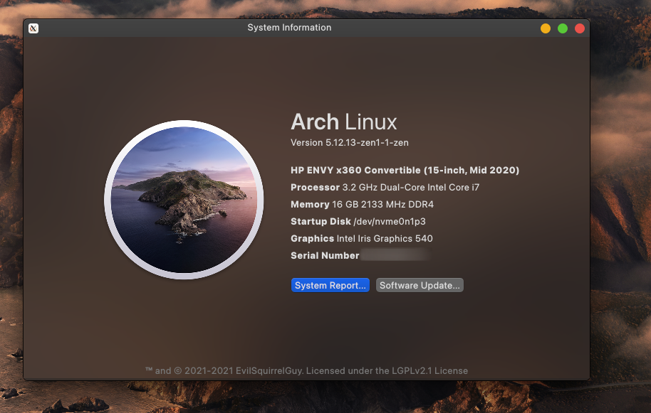

# QtFetch

A system information dialog that shows information about your system in a nice, clean way. Made to mimic macOS's "About this Mac" dialog. The program is still in early development and there is no guarantee that I will continue to develop it either!



Want to see a feature or add one yourself? Make an issue/pull request and I'll see what can be done. There are lots of bugs and it's not optimised at all, so yeah.

### Known Issues

Due to there being no reliable way to gauge the manufacture date of the system (that I know of), the program uses BIOS install date, which is unreliable if you have ever updated your BIOS (as can be demonstrated in the screenshot, my system ain't that new!)

If some values are showing up as unknown, then either:
  a) you haven't run the program with `sudo`/`doas` which hasn't allowed it to cache some data (such as RAM frequency and type, and serial number) as this uses `dmidecode` and only works as root.
  b) your PC doesn't provide the info
  c) my program is broken

Yes, running an untrusted piece of software as root is scary, but you can read through the code to check if I've added any backdoors/malware. (hint: i haven't). If you don't really care about these values then you don't have to.

**The buttons at the bottom don't work!** This is because I haven't coded them to do anything lol.

**Help, it's showing the wrong OS name/version!** Due to me having limited test cases and time to test this program, it may not work correctly on some distros that don't use the standard `/etc/os-release`. I made the program on Arch and used example os-release files from Debian, Ubuntu and OpenSUSE to make the OS Detection not bad.

***
```Made with <3, vim, and VS Code```
